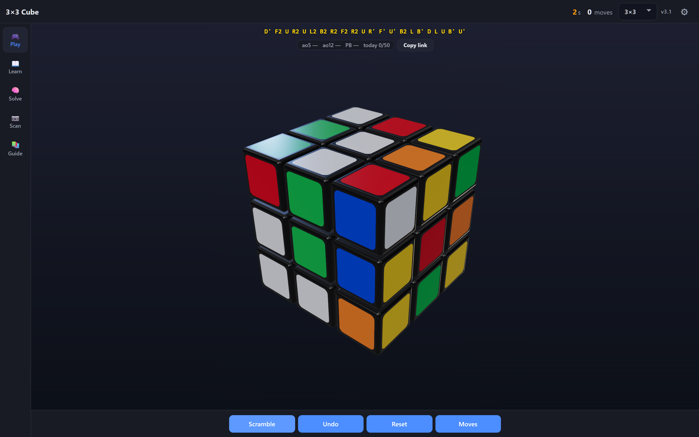

# Cube Lab

A browser trainer for Rubik’s cubes. Play 2×2 through 5×5, learn the beginner method, CFOP, and Roux, scan a physical cube, and follow beginner steps or a fast solve — all on one page, with no account and no build step.

**Demo:** [cube.maxmode-now.com](https://cube.maxmode-now.com/)

<p align="center">
  
</p>

English and Korean. Installable as a PWA over HTTPS.

## Modes

**Play** is the default. Drag a face to turn it, drag empty space to orbit, and use the wheel to zoom. Scramble, undo, and reset stay on the bottom bar. After a scramble you get a 15-second inspection, then the first turn starts the timer (hundredths, WCA +2 / DNF). ao5 / ao12 / PB and the session list live on the cube; times stay in localStorage, with no account. The cube size (2×2–5×5) and sticker numbers live in the header and settings.

**Learn** (2×2 and 3×3) walks through a beginner track and, on 2×2, an **Ortega** track (first layer, then one case per step for 7 OLL + 5 PBL). On 3×3, CFOP / 4-look last layer, an F2L case library (41 cases), and Roux (blocks, CMLL, LSE). Each step has a goal diagram, notation, and a demo. Find My Step reads the cube, opens the matching beginner lesson, and can start Beginner solve for this cube.

**Solve** (2×2–5×5) reads the current state and plays a solution. On 2×2 and 3×3 you can follow **Beginner** steps (the same algorithms as the lessons) or **Fast** solve (corner search / Kociemba). 4×4/5×5 always reduce to a 3×3 first. Next move plays one turn; Solve all runs the rest. If you turn a face yourself, the remaining sequence is recomputed.

**Scan** (2×2–5×5) captures all six faces from photos or the camera. Each face can be checked and edited before it is applied. Confirmed 2×2/3×3 scans open beginner steps (Fast solve is a second button). Image data stays in the browser; nothing is uploaded.

**Guide** opens the [written guide hub](https://cube.maxmode-now.com/how-to-solve/) (`/how-to-solve/`) — 2×2–5×5, Beginner, CFOP, Roux, and the F2L / OLL / PLL libraries. The [2×2 Ortega guide](https://cube.maxmode-now.com/how-to-solve-2x2/ortega/) covers 7 OLL + 5 PBL for speed. The [notation reference](https://cube.maxmode-now.com/how-to-solve/notation/) covers U–B, M/E/S, wide and big-cube slices, and x/y/z.

## Controls

| Input | Action |
| --- | --- |
| Drag a face | Turn that layer |
| Shift-click or Shift+key | Counter-clockwise turn |
| Drag empty space | Orbit the camera |
| Scroll wheel | Zoom |
| U D L R F B | Turn that face (also in Settings) |

On a phone, Play / Learn / Solve / Scan sit in the tab bar. Solve collapses to a next-move HUD so the cube stays large. Lessons start in a short peek and expand when you want the full text.

## Run locally

The 3D engine loads Three.js as ES modules, so `file://` will not work.

```bash
python -m http.server 8080
```

Open [http://localhost:8080](http://localhost:8080).

## Deploy

The app is static files. Any HTTPS host is enough: GitHub Pages, nginx, Cloudflare Pages, Netlify.

Ship at least:

```
index.html
how-to-solve/
how-to-solve-2x2/
how-to-solve-3x3/
how-to-solve-4x4/
how-to-solve-5x5/
ko/
manifest.json
sw.js
cube-engine.js
cube-math.js
cube-solver.js
beginner-solver.js
cube-timer.js
cube-review.js
cube-scan.js
lessons.js
f2l-cases.js
solver-worker.js
vendor/cube.js
vendor/solve.js
icons/
```

After publishing a code change, bump the cache name in `sw.js` (`cube-static-v1` → `v2`). Otherwise installed clients keep the previous bundle.

PWA install needs HTTPS and a hostname. It will not appear on `file://` or a bare HTTP IP.

## Internals

| File | Role |
| --- | --- |
| `index.html` | Shell, layout, i18n, mode wiring |
| `cube-timer.js` | Play session times, ao5/ao12, daily goal, inspection penalties |
| `cube-review.js` | Case-drill spaced-repetition queue (localStorage) |
| `cube-solver.js` | Kociemba wrapper around `cubejs` |
| `beginner-solver.js` | Layer-by-layer beginner path for 2×2 and 3×3 |
| `cube-scan.js` | Six-face capture and color mapping |
| `lessons.js` | Tutorial copy and goal diagrams |
| `sw.js` | Precache of local files; runtime cache for CDNs |

Three.js `r160` and `cubejs` 1.3.1 are loaded from CDNs. The solver runs entirely on the client.

## License

[MIT](LICENSE) © 2026 maxmode

## Contact

[maxmode-now.com](https://maxmode-now.com/) · [maxmode.now@gmail.com](mailto:maxmode.now@gmail.com)
